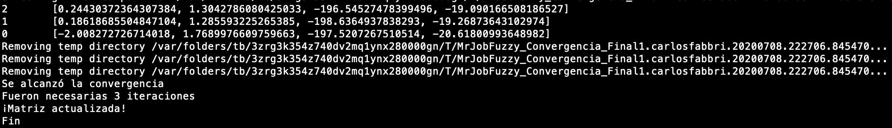
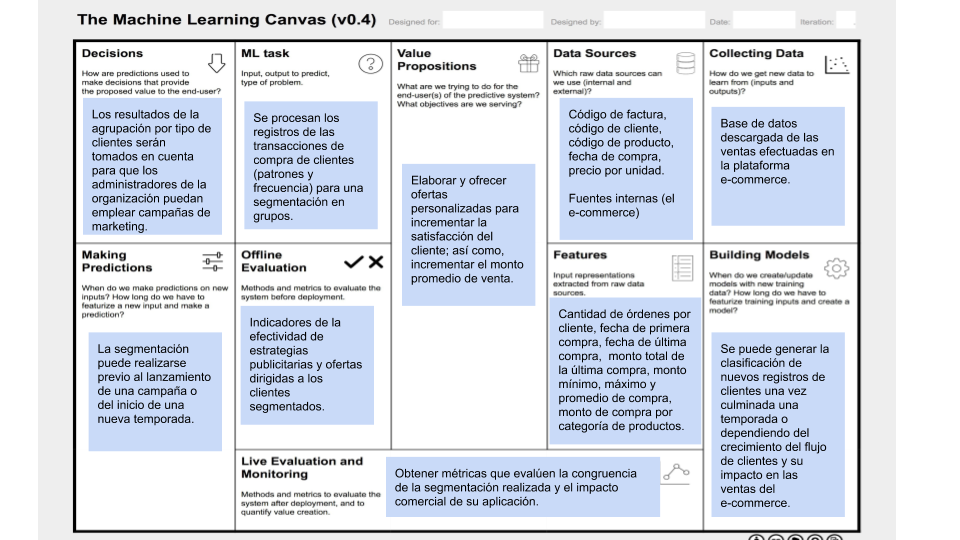
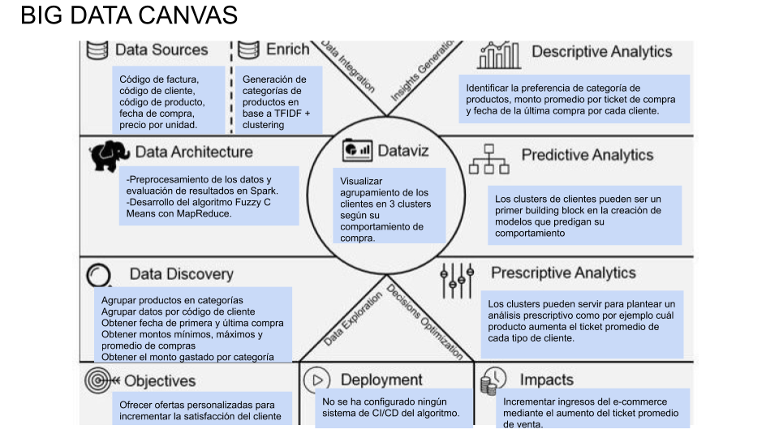

### Proyecto Final del Curso de Big Data Analytics
## Segmentación de Clientes de un e-commerce con Fuzzy C-means en Herramientas Big Data
### Equipo: Irpiri Agreda, Carlos Fabbri, Jazmín Wong

Esta es la página principal del proyecto de Segmentación de Clientes de un e-Commerce con Fuzzy C-means. El proyecto consiste en la utilización de dos herramientas distintas de Big Data, MRJob y Spark, para realizar la segmentación de clientes. Se presenta código implementado en Python y PySpark en donde se demuestran preprocesamiento. Luego, la implementación de la técnica se ha elaborado en MRJob. Finalmente, los resultados, presentados con ayuda de gráficos, se encuentran en formato de Python Notebook. El proyecto tiene como objetivo demostrar la viabilidad de implementación de la técnica Fuzzy C-means en la herramienta MRJob y el potencial de Spark como ambiente de preprocesamiento de datos de gran volumen.

El proyecto está separado en varias páginas: Problema, Abordaje, Preprocesamiento, Implementación en MRJob, Resultados y Conclusiones.

* [Problema](https://github.com/carlosfg97/segmentacionbda/blob/master/problem.md)  
* [Abordaje](https://github.com/carlosfg97/segmentacionbda/blob/master/approach.md)  
* [Preprocesamiento](https://databricks-prod-cloudfront.cloud.databricks.com/public/4027ec902e239c93eaaa8714f173bcfc/3386862589276283/2624492572576674/8818258603877920/latest.html?fbclid=IwAR29iGzDE_ctLSuMZ-CVruM1aZ_SO6pqTDpxVSCQRLs6zqc_dCblO6A8kN4)  
(Ejecución de todo el preprocesamiento puede tomar 10 minutos)  
* [Implementación en MRJob](https://github.com/carlosfg97/segmentacionbda/blob/master/code/MrJobFuzzy_Convergencia_Final1.py)  
Ejecutar desde terminal asegurando que los archivos datos_pca.csv y export-1.txt se encuentran en la misma ruta.
```
python MrJobFuzzy_Convergencia_Final1.py datos_pca.csv
```
(Ejecución puede tomar 5-10 minutos y en promedio converge en 3 iteraciones)  
   
* [Resultados](https://databricks-prod-cloudfront.cloud.databricks.com/public/4027ec902e239c93eaaa8714f173bcfc/3386862589276283/2624492572576674/8818258603877920/latest.html?fbclid=IwAR29iGzDE_ctLSuMZ-CVruM1aZ_SO6pqTDpxVSCQRLs6zqc_dCblO6A8kN4)  
* [Conclusiones](https://github.com/carlosfg97/segmentacionbda/blob/master/conclusiones.md)

Adicionalmente, se elaboró el Machine Learning Canvas y el Big Data Canvas de la solución planteada.


  
  
  

## Referencias

Además de las fuentes citadas en el archivo de Preprocesamiento y Resultados, también se revisaron:
* https://www.kaggle.com/prateekk94/fuzzy-c-means-clustering-on-iris-dataset  
* https://github.com/gabrielspmoreira/kmeans_mapreduce_thunders

